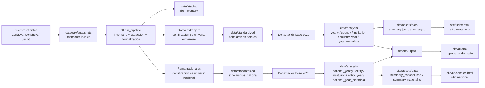

# Padrón de Becas MX

Pipeline reproducible para integrar el padrón histórico de becas publicado por Conacyt, Conahcyt y Secihti, estandarizarlo y publicarlo como datos analíticos, reporte Quarto y sitio estático bilingüe.

## Estado actual

El repositorio ya integra dos universos analíticos:

- `Becas al extranjero` entre `2012` y `2026`
- `Becas nacionales` entre `2012` y `2026`

Reglas de cobertura:

- `2012-2025` se procesan como años con cobertura anual.
- `2026` se incluye como año parcial porque la fuente disponible en snapshots solo cubre `Enero-Marzo`.
- El sitio lo indica de forma explícita en el selector anual.
- El proyecto no usa DuckDB ni depende de una base local para correr.

## Qué hace

El pipeline trabaja sobre snapshots locales `.xlsx/.xls/.csv`, detecta encabezados, identifica el universo analítico aplicable, normaliza variables clave y genera salidas listas para análisis y publicación.

En la versión actual:

- `extranjero` usa archivos dedicados por año cuando existen y filtros sobre `S190` para `2025-2026`
- `nacionales` usa archivos dedicados por año cuando existen y filtros sobre `S190` para `2025-2026`
- se excluyen de `nacionales` apoyos no equivalentes al universo central, como `posdoctorales`, `sabáticas` y `repatriación`

## ETL

El proceso ETL está concentrado en `etl/pipeline.py` y en parsers especializados por universo en `etl/rules/`.

Etapas:

1. `Extract`
   - `discover_source_files()` recorre `data/raw/snapshots/`
   - `build_inventory()` genera un inventario con año, cobertura, pista de programa y banderas de candidato
   - `parse_foreign_scholarship_file()` y `parse_national_scholarship_file()` leen la primera hoja útil de cada archivo

2. `Transform`
   - detección automática de la fila de encabezados
   - limpieza y homogeneización de nombres de columnas
   - filtrado del universo analítico
   - `extranjero`: país distinto de México o marcadores de extranjero en `modalidad/convocatoria`
   - `nacionales`: país México o marcadores de nacional en `modalidad/convocatoria`
   - exclusión de tipos fuera de alcance en `nacionales`, como `posdoctorales`, `sabáticas` y `repatriación`
   - normalización conservadora de nombres de persona, país, entidad, institución y grado
   - cálculo de montos reales de 2020 con el catálogo de deflactores

3. `Load`
   - escritura de tablas maestras en `data/standardized/`
   - construcción de agregados analíticos en `data/analysis/`
   - exportación de semillas del frontend en `site/assets/data/`

Principales componentes:

- `etl/io_utils.py`: descubrimiento de archivos, metadatos de cobertura y detección de candidatos
- `etl/rules/foreign_scholarships.py`: parser del universo de extranjero
- `etl/rules/national_scholarships.py`: parser del universo nacional
- `etl/pipeline.py`: orquestación, deflactación, agregados y exportación al sitio
- `data/catalogs/*.csv`: catálogos manuales de apoyo a la normalización

## Qué produce

Al correr el pipeline principal se generan estos archivos:

1. `data/staging/file_inventory.csv`
2. `data/staging/file_inventory.parquet`
3. `data/standardized/scholarships_foreign.csv`
4. `data/standardized/scholarships_foreign.parquet`
5. `data/standardized/scholarships_national.csv`
6. `data/standardized/scholarships_national.parquet`
7. `data/analysis/yearly_summary.csv`
8. `data/analysis/country_summary.csv`
9. `data/analysis/institution_summary.csv`
10. `data/analysis/country_year_summary.csv`
11. `data/analysis/institution_year_summary.csv`
12. `data/analysis/knowledge_area_year_summary.csv`
13. `data/analysis/degree_year_summary.csv`
14. `data/analysis/year_metadata.csv`
15. `data/analysis/national_yearly_summary.csv`
16. `data/analysis/national_entity_summary.csv`
17. `data/analysis/national_institution_summary.csv`
18. `data/analysis/national_entity_year_summary.csv`
19. `data/analysis/national_institution_year_summary.csv`
20. `data/analysis/national_knowledge_area_year_summary.csv`
21. `data/analysis/national_degree_year_summary.csv`
22. `data/analysis/national_year_metadata.csv`
23. `site/assets/data/summary.json`
24. `site/assets/data/summary.js`
25. `site/assets/data/summary_national.json`
26. `site/assets/data/summary_national.js`

## Sitio estático

La miniweb en `site/` consume datos ya procesados.

Vistas públicas actuales:

- `site/index.html`: análisis de becas al extranjero
- `site/nacionales.html`: análisis de becas nacionales

Navegación:

- desde la portada de `extranjero` hay un botón `Nacionales`
- desde la portada de `nacionales` hay un botón `Extranjero`

Hoy el sitio de `extranjero` muestra:

- KPIs acumulados de la serie
- barra anual de becas por año
- mapa mundial con círculos escalados por número de becas en el país destino
- control para moverse año por año
- aviso visible cuando el año es parcial
- ranking de destinos del año seleccionado
- treemap de instituciones destino del año seleccionado, escalado por monto
- rankings globales de países e instituciones
- interfaz bilingüe `es/en`

Hoy el sitio de `nacionales` muestra:

- KPIs acumulados de la serie
- barra anual de becas por año
- mapa teselado de entidades con círculos escalados por número de becas
- control para moverse año por año
- aviso visible cuando el año es parcial
- ranking de entidades del año seleccionado
- treemap de instituciones del año seleccionado, escalado por monto
- rankings globales de entidades e instituciones
- interfaz bilingüe `es/en`

## Estructura

```text
.
|-- data/
|   |-- raw/
|   |   `-- snapshots/
|   |-- staging/
|   |-- standardized/
|   |-- analysis/
|   `-- catalogs/
|-- db/
|-- docs/
|   |-- DATA_DICTIONARY.md
|   `-- SIPOC.md
|-- etl/
|   |-- config.py
|   |-- country_utils.py
|   |-- io_utils.py
|   |-- normalize.py
|   |-- pipeline.py
|   |-- run_pipeline.py
|   `-- rules/
|       |-- foreign_scholarships.py
|       `-- national_scholarships.py
|-- reports/
|   |-- _quarto.yml
|   |-- index.qmd
|   `-- metodologia.qmd
|-- site/
|   |-- index.html
|   |-- nacionales.html
|   |-- index_old.html
|   `-- assets/
|       |-- css/
|       |-- data/
|       |-- js/
|       `-- maps/
|-- tests/
|-- scripts/
|-- environment.yml
|-- pyproject.toml
`-- README.md
```

## Flujo de datos

1. `data/raw/snapshots/`: archivos oficiales congelados.
2. `data/staging/`: inventario de archivos fuente y metadata de cobertura.
3. `data/standardized/`: tablas maestras integradas de `extranjero` y `nacionales`.
4. `data/analysis/`: agregados por año, geografía e institución.
5. `site/assets/data/`: datos listos para ambas vistas de la miniweb.



## Inconsistencias entre archivos fuente

El padrón histórico no tiene una estructura estable. Estas son las principales inconsistencias que el pipeline tiene que absorber o documentar:

1. La unidad publicada cambia por año.
   - Hay años con archivos dedicados para `extranjero` o `nacionales`.
   - Hay años mixtos, como `S190`, donde el universo se tiene que inferir por reglas.

2. La fila de encabezados no siempre está en la misma posición.
   - Algunos archivos traen filas previas de presentación o formato antes del encabezado real.

3. El nombre de la columna de beneficiario cambia.
   - Aparece como `NOMBRE BECARIO` en unos archivos y como `NOMBRE` en otros.

4. El identificador consecutivo no es totalmente estable.
   - Aparece como `CONSEC` o `CONSEC.` según el archivo.

5. La variable geográfica no es homogénea.
   - `extranjero` depende principalmente de `PAIS`.
   - `nacionales` depende de `ENTIDAD`, pero esa columna no siempre está presente o viene con variantes de escritura.

6. La presencia de `PAIS` no es consistente.
   - En varios archivos nacionales dedicados el país no viene explícito y se tiene que imputar como `México` por contexto del archivo.

7. Los nombres de columnas de monto cambian entre años.
   - El importe puede aparecer como `IMPORTE PAGADO`, `TOTAL PAGADO`, `IMPORTE TOTAL` o variantes por periodo.

8. El periodo cubierto cambia y no siempre es anual.
   - `2026` solo cubre `Enero-Marzo`.
   - El pipeline marca esta diferencia en `year_metadata` y en el sitio.

9. Las variables de fecha no son uniformes.
   - `INICIO DE BECA`, `FIN DE BECA` y `TERMINO DE BECA` aparecen con distintos nombres según el archivo.

10. `modalidad` y `convocatoria` no tienen un vocabulario estable.
   - En años mixtos esas variables son necesarias para separar `extranjero` de `nacionales`.

11. La clasificación por tipo de apoyo cambia entre años.
   - En algunos años el archivo ya viene separado.
   - En otros, el proyecto tiene que excluir manualmente universos fuera de alcance como `posdoctorales`, `sabáticas` y `repatriación`.

12. Los nombres de instituciones y personas vienen con variaciones de escritura.
   - Hay diferencias de mayúsculas, acentos, abreviaturas, sufijos legales y orden de nombres.

13. La disponibilidad pública no es estable.
   - `2021` ya no está visible en la web vigente, pero fue reincorporado desde el repositorio histórico del proyecto.

## Diferencias respecto al repo original

Este repositorio no es una extensión menor del proyecto anterior.

1. El repo original estaba orientado a un análisis puntual; este repo está orientado a construir bases integradas y reproducibles.
2. El repo actual separa explícitamente `raw`, `staging`, `standardized`, `analysis` y `site`.
3. El repo actual asume que el formato oficial cambia entre años y modela esa variación como parte del pipeline.
4. El repo actual trabaja sobre snapshots locales versionables del padrón.
5. El repo actual incorpora trazabilidad por archivo, hoja, fila y observaciones de normalización.
6. El repo actual calcula montos reales base 2020 dentro del ETL.
7. El repo actual genera salidas reutilizables para CSV, Parquet, JSON, Quarto y sitio estático.
8. El repo actual incluye `2026` como año parcial con señalización explícita en la interfaz.
9. El repo actual ya no cubre solo `extranjero`; también integra una rama paralela de `nacionales`.
10. El repo actual publica dos vistas conectadas por botones en la navegación superior.

## Tablas principales

Las salidas centrales son:

- `scholarships_foreign`
- `scholarships_national`

Campos principales compartidos:

1. `record_id`
2. `snapshot_id`
3. `source_year`
4. `program_category`
5. `admin_label`
6. `person_name_raw`
7. `person_name_canonical`
8. `person_name_key`
9. `country_raw`
10. `country_canonical`
11. `entity_raw`
12. `entity_canonical`
13. `institution_raw`
14. `institution_canonical`
15. `study_program_raw`
16. `knowledge_area_raw`
17. `degree_raw`
18. `degree_canonical`
19. `start_date_raw`
20. `end_date_raw`
21. `amount_nominal_mxn`
22. `deflator_base_2020`
23. `amount_real_mxn_2020`
24. `source_file_name`
25. `source_sheet_name`
26. `row_number_source`
27. `normalization_notes`
28. `duplicate_review_flag`

Definiciones completas en [docs/DATA_DICTIONARY.md](D:\PROYECTOS_PERSONALES\becas_conahcyt_actualizado\docs\DATA_DICTIONARY.md).

## Regla monetaria

Los montos reales se calculan con base `2020 = 100`.

Fórmula:

```text
Q2 = Q1 x (D2 / D1)
```

En este proyecto:

- `Q1`: monto nominal reportado por la fuente
- `D1`: deflactor implícito del año origen
- `D2`: `100`, porque la base es 2020
- `Q2`: monto en pesos reales base 2020

Catálogo usado: `data/catalogs/deflactors_base_2020.csv`.

## Trazabilidad

Cada registro estandarizado conserva información para auditar la transformación:

- `snapshot_id`
- `source_file_name`
- `source_file_path`
- `source_sheet_name`
- `row_number_source`
- `normalization_notes`

## SIPOC

El SIPOC detallado del proceso vive en [docs/SIPOC.md](D:\PROYECTOS_PERSONALES\becas_conahcyt_actualizado\docs\SIPOC.md).

## Cómo correr

Con el ambiente Conda activo:

```powershell
python -m etl.run_pipeline
python -m unittest discover -s tests
quarto render reports
```

## Fuente oficial

Las fuentes públicas que motivan la estructura variable del pipeline son:

- [Padrón de beneficiarios SECIHTI](https://secihti.mx/padron-de-beneficiarios/)
- [Histórico de becas de posgrado](https://secihti.mx/becas_posgrados/padron-de-beneficiarios/)
