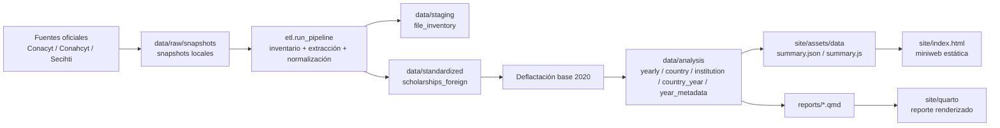

# Padrón de Becas al Extranjero MX

Pipeline reproducible para integrar el padrón histórico de becas al extranjero publicado por Conacyt, Conahcyt y Secihti, estandarizarlo y publicarlo como datos analíticos, reporte Quarto y sitio estático bilingüe.

## Estado actual

El repositorio ya integra la serie histórica disponible para becas al extranjero entre 2012 y 2026.

- `2012-2025` se procesan como años con cobertura anual.
- `2026` se incluye como año parcial porque la fuente disponible en snapshots solo cubre `Enero-Marzo`.
- El sitio lo indica de forma explícita en el selector anual.
- El proyecto no usa DuckDB ni depende de una base local para correr.

## Qué hace

El pipeline trabaja sobre snapshots locales `.xlsx/.xls/.csv`, detecta encabezados, extrae el universo de becas al extranjero, normaliza variables clave y genera salidas listas para análisis y publicación.

## Qué produce

Al correr el pipeline principal se generan estos archivos:

1. `data/staging/file_inventory.csv`
2. `data/staging/file_inventory.parquet`
3. `data/standardized/scholarships_foreign.csv`
4. `data/standardized/scholarships_foreign.parquet`
5. `data/analysis/yearly_summary.csv`
6. `data/analysis/country_summary.csv`
7. `data/analysis/institution_summary.csv`
8. `data/analysis/country_year_summary.csv`
9. `data/analysis/institution_year_summary.csv`
10. `data/analysis/year_metadata.csv`
11. `site/assets/data/summary.json`
12. `site/assets/data/summary.js`

## Sitio estático

La miniweb en `site/` consume `summary.js` y `world-map.js` ya procesados.

Hoy muestra:

- KPIs acumulados de la serie
- barra anual de becas por año
- mapa mundial con círculos escalados por número de becas en el país destino
- control para moverse año por año
- aviso visible cuando el año es parcial
- ranking de destinos del año seleccionado
- treemap de instituciones destino del año seleccionado, escalado por monto
- rankings globales de países e instituciones
- interfaz bilingüe `es/en`

## Estructura

```text
.
|-- data/
|   |-- raw/
|   |   `-- snapshots/
|   |-- staging/
|   |-- standardized/
|   |-- analysis/
|   `-- catalogs/
|-- db/
|-- docs/
|   |-- DATA_DICTIONARY.md
|   `-- SIPOC.md
|-- etl/
|   |-- config.py
|   |-- country_utils.py
|   |-- io_utils.py
|   |-- normalize.py
|   |-- pipeline.py
|   |-- run_pipeline.py
|   |-- build_site_data.py
|   `-- rules/
|       `-- foreign_scholarships.py
|-- reports/
|   |-- _quarto.yml
|   |-- index.qmd
|   `-- metodologia.qmd
|-- site/
|   |-- index.html
|   `-- assets/
|       |-- css/
|       |-- data/
|       |-- js/
|       `-- maps/
|-- tests/
|-- environment.yml
|-- pyproject.toml
`-- README.md
```

## Flujo de datos

1. `data/raw/snapshots/`: archivos oficiales congelados.
2. `data/staging/`: inventario de archivos fuente y metadata de cobertura.
3. `data/standardized/`: tabla maestra integrada de becas al extranjero.
4. `data/analysis/`: agregados por año, país e institución.
5. `site/assets/data/`: datos listos para la miniweb.



## Diferencias respecto al repo original

Este repositorio no es una extensión menor del proyecto anterior.

1. El repo original estaba orientado a un análisis puntual; este repo está orientado a construir una base integrada y reproducible.
2. El repo actual separa explícitamente `raw`, `staging`, `standardized`, `analysis` y `site`.
3. El repo actual asume que el formato oficial cambia entre años y modela esa variación como parte del pipeline.
4. El repo actual trabaja sobre snapshots locales versionables del padrón.
5. El repo actual incorpora trazabilidad por archivo, hoja, fila y observaciones de normalización.
6. El repo actual calcula montos reales base 2020 dentro del ETL.
7. El repo actual genera salidas reutilizables para CSV, Parquet, JSON, Quarto y sitio estático.
8. El repo actual incluye 2026 como año parcial con señalización explícita en la interfaz.
9. El repo actual agrega un mapa anual por país destino con navegación año por año.

## Tabla principal

La salida central es `scholarships_foreign`.

Campos principales:

1. `record_id`
2. `snapshot_id`
3. `source_year`
4. `program_category`
5. `admin_label`
6. `person_name_raw`
7. `person_name_canonical`
8. `person_name_key`
9. `country_raw`
10. `country_canonical`
11. `institution_raw`
12. `institution_canonical`
13. `study_program_raw`
14. `knowledge_area_raw`
15. `degree_raw`
16. `degree_canonical`
17. `start_date_raw`
18. `end_date_raw`
19. `amount_nominal_mxn`
20. `deflator_base_2020`
21. `amount_real_mxn_2020`
22. `source_file_name`
23. `source_sheet_name`
24. `row_number_source`
25. `normalization_notes`
26. `duplicate_review_flag`

Definiciones completas en [docs/DATA_DICTIONARY.md](D:\PROYECTOS_PERSONALES\becas_conahcyt_actualizado\docs\DATA_DICTIONARY.md).

## Regla monetaria

Los montos reales se calculan con base `2020 = 100`.

Fórmula:

```text
Q2 = Q1 x (D2 / D1)
```

En este proyecto:

- `Q1`: monto nominal reportado por la fuente
- `D1`: deflactor implícito del año origen
- `D2`: `100`, porque la base es 2020
- `Q2`: monto en pesos reales base 2020

Catálogo usado: `data/catalogs/deflactors_base_2020.csv`.

## Trazabilidad

Cada registro estandarizado conserva información para auditar la transformación:

- `snapshot_id`
- `source_file_name`
- `source_file_path`
- `source_sheet_name`
- `row_number_source`
- `normalization_notes`

## SIPOC

El SIPOC detallado del proceso vive en [docs/SIPOC.md](D:\PROYECTOS_PERSONALES\becas_conahcyt_actualizado\docs\SIPOC.md).

## Cómo correr

Con el ambiente Conda activo:

```powershell
python -m etl.run_pipeline
python -m unittest discover -s tests
quarto render reports
```

## Fuente oficial

Las fuentes públicas que motivan la estructura variable del pipeline son:

- [Padrón de beneficiarios SECIHTI](https://secihti.mx/padron-de-beneficiarios/)
- [Histórico de becas de posgrado](https://secihti.mx/becas_posgrados/padron-de-beneficiarios/)
